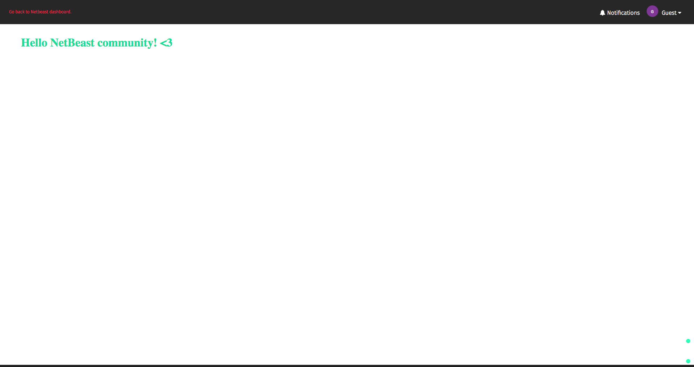

# Writing your first application

A Netbeast application allows you to control how devices interact each other. With Netbeast, you don't have to take care about wich brand or technology devices are using, you only need to say what topic you want to control (lights, sound, sensors...) and the value you want to give them (color, power, track...)

In this section we are going to explain how to create apps to run on the Netbeast dashboard. Here you will see a basic example of applications and how it is made.


## Fast mode – scaffolding
Let's start.
```
netbeast new myapp
``` 
That will create a new folder named _myapp_ with the basic structure of a Netbeast application.

Run the following code:
```
cd myapp
npm install # by default, dependencies are not included
node index.js --port 3000
```

And you're done! You can now access your application under `http://localhost:3000`. 

It's time to open your favorite editor and start developing.

## Anatomy of a Netbeast application

Every Netbeast app is a npm package. To understand how apps work we will create an application from scratch and learn about all its components.

First off, open a terminal and type:
```
mkdir myapp
cd myapp
```

Now open on the _myapp_ folder your favourite editor.

**A basic Netbeast app looks like this:**
```
.
├── index.html
├── node_modules
│   ├── express
│   └── minimist
├── package.json
└── server.js

```

### The configuration file - package.json
npm uses package.json to maintain a package and check for dependencies. It's also useful to  create development workflow.

Netbeast will make use of this file to reduce the overhead of configuration needed to get up and running. It will look for the `main` field to launch the app. Create such file and copy and add the following content into it:

```json
{
    "name":"myapp",
    "version": "1.0.0",
    "description": "My very first Netbeast application.",
    "main": "server.js",
    "dependencies": {
        "express": "^4.12.3",
        "minimist":"^1.1.0"
    },
    "devDependencies":{},
    "scripts":{
        "test":"node server.js --port 31416",
        "start": "node server.js"
    },
    "keywords": [ "iot","netbeast","app"],
    "author": "me@me.me",
    "license": "GPL 2",
}

```

**You can also create package.json using npm!** Open a terminal and type:
```
npm init    # And fill the gaps!
```

### The backend - server.js
We specified in the package that `server.js`is our main file. Now we have to create a HTTP server to run the app. There's a lot of incredible things that you can do combining [node.js](https://nodejs.org/en/) and [express](http://expressjs.com/) but to keep it simple just copy and paste the following code into _server.js_:

```javascript
#!/usr/bin/env node

/* Requires node.js libraries */
var express = require('express')
var app = express()

// Netbeast apps must accept the port to launch a HTTP server.
var argv = require('minimist')(process.argv.slice(2))
port = argv.port || 31416

if(isNaN(port)) {
	console.log("Port \"%s\" is not a number.", port)
	process.kill(1)
}

app.use(express.static(__dirname))

var server = app.listen(port, function () {
  console.log('Example app listening at http://%s:%s',
  	server.address().address,
  	server.address().port)
})
```

See the **shebang**? (First line of the script `#!/usr/bin/env node`) It tells Netbeast which interpreter to use when launching an app. We use this line to set node.

_main_ has to be an executable file. Make sure it has the appropriate permissions:
```
chmod +x server.js
```
As you can see in the code, the server must accept the port by parameter, that's so that Netbeast can open the app.

To achieve that we use [minimist](https://www.npmjs.com/package/minimist), but there are other command parsers available such as [Commander](https://www.npmjs.com/package/commander). Using minimist, you just need the following lines:
```
var argv = require('minimist')(process.argv.slice(2))
port = argv.port || 31416
```

We mentioned express before. It's a http node.js lightweight framework.

You will need both packages for the app to work. Installing them with npm will include them in the _node_modules_ folder. To do so, run:
```
npm install express minimist
```

### The frontend - index.html

The frontend to our web application will be a simple html file. Create a file called _index.html_ and include the following as its content:

```html
<!DOCTYPE html>
<html>
<head>
	<title>My first Netbeast app</title>
</head>
<style type="text/css">
	body {
		font-family: arial;
	}
</style>
<body>
	<h1>
		Hello Netbeast community! <a style="color: red">&#9829;</a>
	</h1>
</body>
</html>
```


Strictly speaking, applications don't need a UI. You can use other ways to interact with the user such as push notifications.

## Wrap up - launching our application

You now have all that you need. Let's get your app up and running:
```
./server.js --port 8000
```
You will be able to open a browser at http://localhost:8000 and see:


