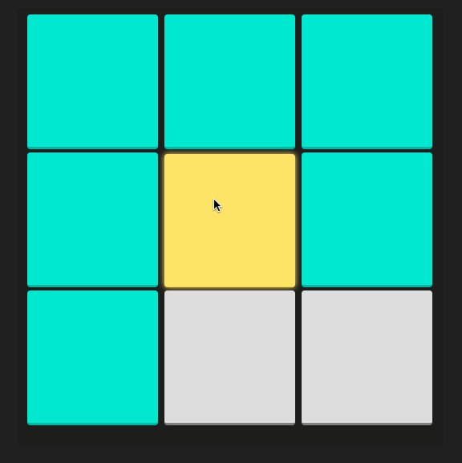

# First steps

The **Dashboard** is the place from where you can manage applications installed on
your Netbeast. And any device running Dashboard can be found in the network as a
Netbeast.

# Installing an application

An app stands for the most common known web app, it can be everything from a web page to a complete HTML5 app with great UX. To illustrate this we have created a fun app and made it available as a Netbeast app.

Go to your running dashboard `install -> with Git` and use the following repo:

https://github.com/netbeast/padjs

After installation go back again to `apps` and you will be able to try out your brand new sampler pad! Just click onto its icon `padjs` to launch it.

#Installing a plugin

Plugin is an app that allows you to control a piece of hardware, take a look [here](../devices_currently_supported/index.md) to see how many devices are already supported.

Go back again to the dashboard. This time, choose "explore". There, all available apps and plugins are shown here.

Let's install a 'light' plugin. If you have smart bulbs from **wemo**, **philips hue**, **lifx** or any other kind, you can try to find it among the apps listed. Click `install` on it. Also make sure your smart bulb is connected to the network up and running.

If an app or plugin for device does not exist, do not worry. [You can create your own](../creating_a_plugin/index.md). But for the moment, Look for **bulb-plugin** and click `install`.

Now if you open **bulb-plugin** and the app we previously installed we can see how playing the pad changes the bulb color.

If you have real bulbs or a sound device online (as _sonos_) you will see how it reproduces the sound.

>But, things could go wrong.

In that case click the link "_number_ of devices installed" –watch the first gif on this doc page– and take a look on the map. Look for your devices to check they are up and running. :white_check_mark:

