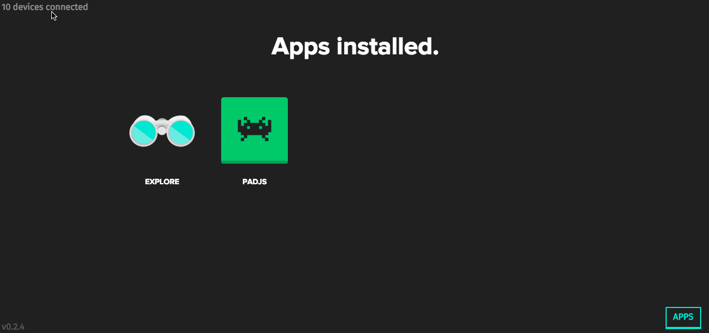

# 1. Install Node.js

Choose your package. Node.js is available for all platforms in https://nodejs.org/en/download/


> But, I want to do it through the command line:

```bash
# 1.b. Mac
brew install node

# 1.c. Using Ubuntu
curl -sL https://deb.nodesource.com/setup_4.x | sudo -E bash -
sudo apt-get install -y nodejs

# 1.c* Using Debian or Raspberry, as root
curl -sL https://deb.nodesource.com/setup_4.x | bash -
apt-get install -y nodejs
```

### Install npm

Once you install Nodejs, npm is included. :white_check_mark:

# 2. Install Netbeast SDK

### Through npm
``` bash
npm install -g netbeast-cli
```
After it finishes you will be able to run it typing:

```bash
netbeast start
```

Dashboard will be started on port 8000 unless you run something like:
```
netbeast start --port 3000
```

Run with _help_ to get all options:
```
netbeast --help
```

### 2.b. Cloning from **git** repo
```bash
git clone https://github.com/netbeast/dashboard/ && cd dashboard
npm i # by default, dependencies are ignored, so must be installed
./index.js --port 8000
```

# Done! :fireworks:
Now you can visit http://localhost:8000 and continue making your [first steps...](../first_steps/index.md)



