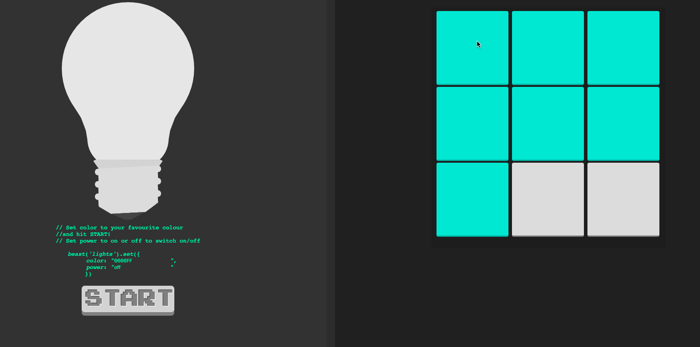

# First steps

Now that you are familiar with the Dashboard, the next step is to get some applications running on it.

# Installing an application

A Netbeast app is, in a nutshell, a web application. We are going to install a fun example app that we made to show you how it works.

Go to the Dashboard and hit the `install` option, then select `with git` and use the following URL:

https://github.com/netbeast/padjs

After installing, go back to `apps` and you will be able to try out your brand new sampler pad! Just click onto the icon `padjs` to launch it.

#Installing a plugin

Plugins are applications that allow to connect to, communicate with and control a device. We are going to install a plugin that will allow us to control ligths.

Access the Dashboard. This time, choose `explore`. All available apps and plugins are here.

Let's install the light plugin. If you have smart bulbs like **WeMo**, **Philips Hue** or **Lifx**, you can find plugins for those brands among the apps listed. 

Click `install` on your light brand's plugin (we'll use our generic `bulb-plugin`). Make sure your smart bulb is connected to the network.

Once installed, if you open **bulb-plugin** and the **padjs** app, you can see how playing the pad changes the bulb color.

Padjs also works with real life lights, install a plugin for your lights' brand and give it a try!

>If you have connectivity issues with a device, access the network section as it will help you diagnosing what may be the problem.

You are now ready to start developing apps and plugins!
