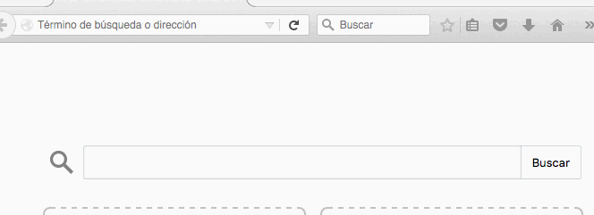

##Netbeast OS for Raspberry Pi 2

In this guide we will introduce some basic concepts about the Netbeast Operative System (NB OS). 

* [What is the Netbeast](#What)
* [Current Release and Features](#Release)
* [How to install it](#Install)
* [First Boot](#Boot) 
* [SSH Access](#SSH)
* [Usual Problems](#Problems)





<a name="What">
## What is the Netbeast OS 

The Netbeast OS for Raspberry Pi 2 is an operative system based on Linux core. This Linux distribution is composed entirely of free and open-source software, which is under the GNU Public License.

The first NetBeast OS is based on Raspbian Distribution which allow you to install it on your RPI2.

The Netbeast OS has the Netbeast Dashboard included. This will allow you to control all the smart devices that you have at home. You won't need internet connection in order to manage your devices. You just need to install it, power it on and wait until "Netbeast-$Animal" network appears. Then connect all your smart devices to it and let's start controlling. 

[**DOWNLOAD IT NOW**](https://sourceforge.net/projects/netbeast/files/latest/download)
<a name="Release">

<a name="Release">
## Current Release and Features

- [x] RPI2 Support: The First NB-OS release can be installed on your RPI2.

- [x] Auto-Resize: You don't need to worry about expanding the OS image, It will be done automatically.

- [x] Dashboard Startup: The Netbeast Dashboard will star automatically on boot.

- [x] Animal Network: On first boot, network will be named as a random animal.

- [X] Netbeast Api included : This feature allows to control all your smart devices regardless of their brands.

- [x] URL router access: You can access to NB-OS Dashboard typing http://home.netbeast

- [x] Deleted some useless Packages.

<a name="Install">
## How to install it

**Prerequisites**
* Raspberry Pi model 2
* Micro SD, minimum 4GB, recommended 8GB
* Wifi Dongle (Optional)


**Saving the Netbeast OS in your SD Card**


* [**DOWNLOAD THE NETBEAST OPERATIVE SYSTEM**](https://sourceforge.net/projects/netbeast/files/latest/download)

* Once you have downloaded the Netbeast OS, uncompress it, you will get "NB.OS.img"

* Format your SD

You are free to use any tool you want. I usually use "Disks" for Linux and "Disk Utility" for Mac.

* Identify your SD

LINUX: 
```
sudo df -h
#This command will list all your storage devices on your computer. 
#Just look for your SD filesystem name. It should be something like 
# /dev/mmcblk*
```
MAC
```
diskutil list
#Look for your SD identifier. It should be something like
# "/dev/disks1"
```

* Umount your SD

LINUX: 
```
umount /dev/mmcblk*p*
#This command will amount your sd. You need to do it if you want save an img on it.
#You have to umount the partition that your sd has. Normally, when you do the previous step
#your sd has one partition created.
#Example: 
# umount /dev/mmcblk0p1  #p1 is the partition number of my sd named mmcblk0 
```
MAC
```
diskutil umount /dev/disk3s1
#This command will amount your sd. You need to do it if you want save an img on it.
#You have to umount the partition that your sd has. Normally, when you do the previous step
#your sd has one partition created.
#Example:
# diskutil umount /dev/disk3s1 #s1 is the partition number of my sd named disk3
```

* Save the NB-OS.Img

LINUX 
```
sudo dd if=route/to/NB-OS.img of=SDIdentifier
#Example:
#sudo dd if=NB-OS.img of=/dev/mmcblk0
```
MAC
```
sudo dd bs=1m if=route/to/NB-OS.img of=rSDIdentifier
#Example:
#sudo dd bs=1m if=NB-OS.img of=/dev/rdisk2
```

* Once you have completed all the steps below successfully, you have the Netbeast OS installed on your SD. Now, go to the next section [First Boot](#Boot) and you will know what happens the first time you boot the Netbeast OS. 

<a name="Boot">
## First Boot

It is assumed that you have download the Netbeast OS and installed on your SD Card. If don't go to the previous section [How to install it](#Install).

Once you have installed the Netbeast OS you are ready to put it on your RPI2 and power it on. 

**The boot process is as follow:**

* Filesystem is expanded depending on your SD size.

* Network is named as "Netbeast-Animal" where animals is a random name between three hundred options. (If you **don't have dongle wifi**, go to Usual Problems Section [here](#Problems))

```
By default, the network configuration is:

Wifi Network Name: Netbeast-Animal

Wifi Network Password:netbeast (We recommend change the password)
```

* Dashboard is started on boot. 

In order to start using the **Netbeast Dashboard** connect to the network that has been created like "Netbeast-Animal.

**Once you has been connected** to the Netbeast network, go to your favourite browse and **type on the nav bar home.netbeast**

 Then you will be able to see the dashboard and start installing amazing app for your smart home devices.

<a name="SSH">
## SSH Access

If you are a developer maybe you want to access to the rpi through ssh for installing some dependences or some scripts that you do.

**For accessing to the rpi through ssh:**

* Connect to the network that NB OS creates. 
 * SSID: Netbeast-Animal
 * Password: netbeast

* Go to your terminal
```
ssh beast@home.netbeast
password: netbeast
```

Also you can use the default access for raspbian
```
ssh pi@home.netbeast
password: raspberry
```

* Then you will be connected to your raspberry pi through ssh

<a name="Problems">
##Usual Problems

1. I don't have a dongle wifi, how can I access to the Netbeast Dashboard?

	The dashboard is running on your Raspberry Pi anyway. However you have to find other way to access to it. You have to know the IP address that the router has given to the Raspberry Pi. You have two choices:

	1. Go to the router menu and look for the Raspberry Pi IP
	2. User the dicover tool by Netbeast [here](discover_your_netbeast.md)
	3. Once you know the IP, you can access to the Dashboard typying on the nav bar
			http://RPI_IP

##References

[Raspbian](https://www.raspbian.org)

[GNU](https://www.gnu.org)

