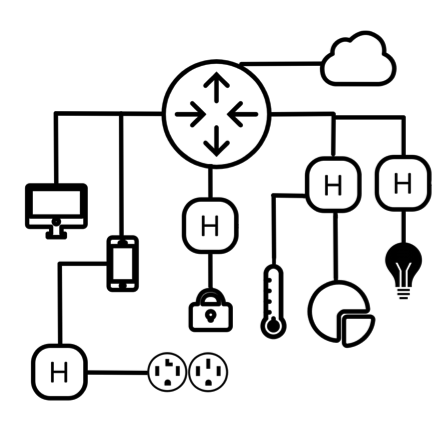
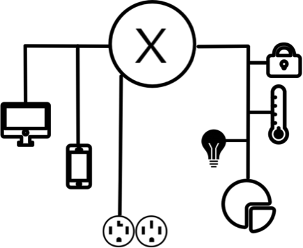

# Why netbeast

# The problem
Most of the things we operate with do not need to have computation capabilities, but to obbey orders that can be scheduled on a mobile phone or the cloud. However in order to communicate with those, you may need to manually configure a wireless conection, which may be complex. You expose your home or phone through third party’s vulnerabilities. Moreover you may need to have a data plan for a certain product for it to work, which dramatically increases its price.

To achieve these communications schemas we can find available in the market certain gateways that offer zigbee, PLC or bluetooth connectivity when plugged to the router. Even though these middle-hardware may accomplish their function, they are mainly developed into close environments and are hardly compatible with other services and isolate their functions behind a certain technology.

Imagine a standard domotic house with different light and thermostat system, therefore two gateways. For them to cooperate messages from the light radio system may be sent to the user smartphone which right after may send a message to the cloud that eventually will send its correspondant primitive to the thermostat service which will arrive, again, by the same smartphone. 

From this short analysis we can appreciate that **there is a huge margin to improve** within non-integrated domotic systems. We could observe the same situation if we extrapolate to smart offices or cities. 

* Homes lack support for widely popular sensor–actuator radio systems like Bluetooth or Zigbee, but normally offer WiFi from the router. They depend on extra devices to offer them.
* Systems from different vendors do not interoperate out of the box with each other…
* … thus systems from different vendors lack the tools to look for resources and operate directly with them as we do with the different resources on our smartphones (accelerometer, magnetometer, camera, GPS…)

###	Security
Having different entry points is a potential risk. In the same imaginary scenario, with only two gateways from different vendors a hacker could try to find vulnerabilites at the routers and both two hubs. Moreover, with this schema we may depend exclusively on the cloud, losing the power to choose how much of our data is purely confidential, with its correspondant lost of confidentiality and intimacy.

## Solution
First of all we could integrate bluetooth or zigbee into router hardware to offer extra communication capabilities the same way we do on smartphones, with little overcost. In this manner, we could remove hubs which only purpose is to be the intermediary with your smartphone. Given that, the security exposure would be genuinly reduced.
Secondly joining all these technologies it could be relatively simple to scan the local network from your smartphone and locate the available resources. We could reveal a certain set of smart locks, lights, washing-machines… 
However in this scenario cloud services may be already needed, or logic performed on smartphones (which might not be home, and thus cloud is needed again). Also some hubs may offer extra compatibility services and new functionalities, so simply adding communication channels does not completely cover the needs of a very young domestic IoT. For this, we are proposing –and which is the locomotiv idea behind netBeast startup– to add computation capabilities to current routers so we can completely port hub functionalities and cloud dounterpart into a single device as applications. 
 
  
Figure 1: Smart Home without next-gen router

  
Figure 2: with a next-generation router

This way instead of buying a gateway for a set of devices we would have a flexible platform where, just by having an application, you can control a set of smart things. Data will be kept confidential –unless wanted– and carriers could dispose for a node in the customers’ home to offer extra functionalities and services.

## Contact
* Visit our site [https://netbeast.co](https://netbeast.co)
* Mail us: staff [at] netbeast.co
* Report a bug or enter discussion at [issues](https://github.com/netbeast-co/docs/issues)
* Other resources: [Dashboard](https://github.com/netbeast-co/dashboard), Netbeast [API](https://github.com/netbeast-co/API)

